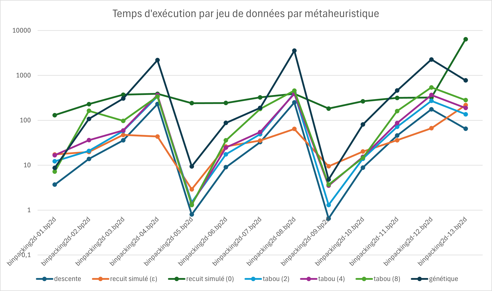
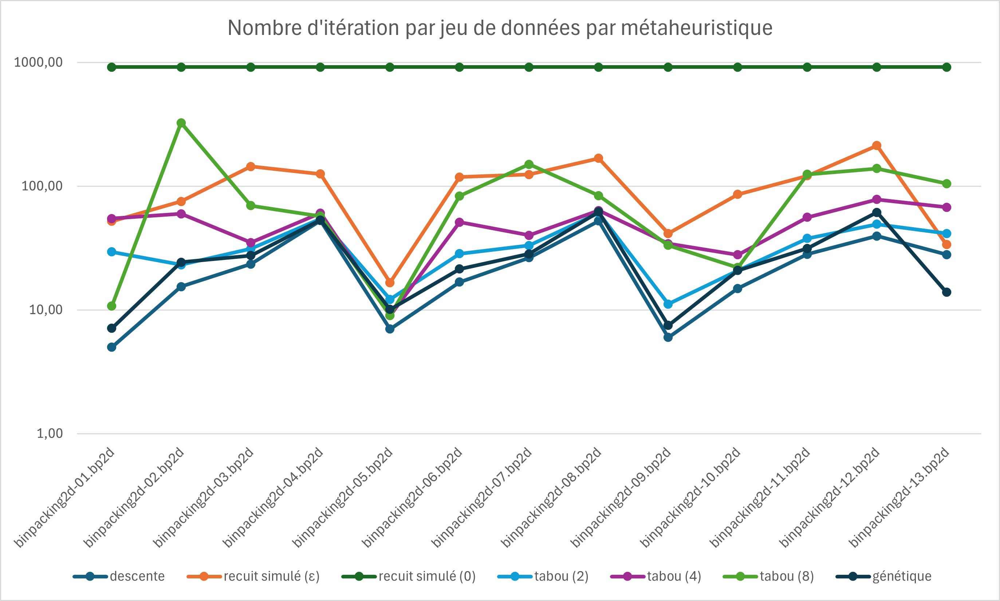
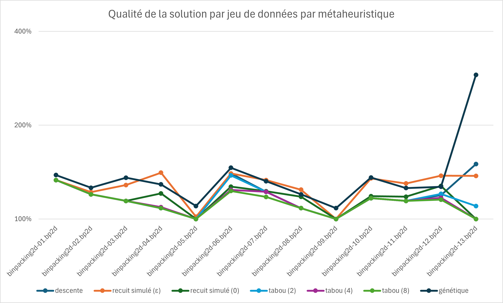

Alban Bernard \
Florian Burdairon

# Projet Optimisation Discrète - Bin Packing

## Exécution du programme

### Prérequis
- Java 21
- Maven

### Exécution avec Maven
Pour exécuter le programme, il suffit de lancer la commande suivante :
```bash
mvn javafx:run
```

### Exécution avec un IDE
Il est également possible d'exécuter le programme avec un IDE en lançant la classe `Main` située dans le package `tp.optimisation`.
> Nous avons uniquement testé le programme avec IntelliJ IDEA.

## Modélisation du problème

Nous sont données les dimensions d'une boîte et une liste d'objets en forme de pavé avec leurs dimensions.
Les boîtes et les objets sont en 2 dimensions (x et y) : 2
On appelle un problème de Bin Packing un problème où il faut ordonner les objets dans les boîtes de manière à utiliser le moins de boîtes possibles : BP
Ce problème peut être séparé en plusieurs configurations : 
 - Si les objets peuvent être tournés : R / Sinon : O
 - Si les objets doivent être ordonnés de manière à ce qu'on puisse toujours guillotiner la boîte, une fois celle-ci remplie : G / Sinon : F
Pour ce projet, la demande était d'autoriser les rotations, mais d'obliger la présence de guillotines : 2 BP R G

Les algorithmes mis en place utilisent un système de voisinage pour s'approcher de la solution optimale.
À partir d'une solution, nous prenons pour voisin toute autre solution qui est le résultat d'un de ces changements :
 - Déplacer un item d'une bin à une autre
 - Déplacer un item d'une bin à une autre et le faire tourner de 90°
 - Échanger deux items
 - Échanger deux items en faisant tourner de 90° l'item 1
 - Échanger deux items en faisant tourner de 90° l'item 2
 - Échanger deux items en les faisant tourner de 90°

Afin de calculer la fitnesse d'une solution, nous additionnons pour chaque bin de la solution la racine carrée du pourcentage de son espace vide.

Afin de remplir les boîtes de manière à respecter les guillotines, nous mettons l'ensemble des items sur des lignes de largeur identique à une boîte,
et "empilons" ces lignes dans la boîte, ainsi, les premières guillotines se feront dans la largeur (pour séparer les lignes)
et toutes les autres seront dans le sens de la hauteur (pour séparer les objets d'une ligne).
Ce système de gestion est tiré de l'algorithme Finite First Fit (FFF).

Pour obtenir une première solution aléatoire, nous n'empilons pas les lignes dans une même boîte, mais créons autant de boîtes qu'il y a de lignes.

## Calculs théoriques

| **Fichier**          | **Surface d'une bin** | **Surface de l'ensemble des items** | **Minimum théorique du nombre de bins** |
|----------------------|-----------------------|-------------------------------------|-----------------------------------------|
| binpacking2d-01.bp2d | 62500                 | 163562                              | 3                                       |
| binpacking2d-02.bp2d | 62500                 | 274563                              | 5                                       |
| binpacking2d-03.bp2d | 62500                 | 407651                              | 7                                       |
| binpacking2d-04.bp2d | 62500                 | 731408                              | 12                                      |
| binpacking2d-05.bp2d | 250000                | 545300                              | 3                                       |
| binpacking2d-06.bp2d | 250000                | 1232057                             | 5                                       |
| binpacking2d-07.bp2d | 250000                | 2004791                             | 9                                       |
| binpacking2d-08.bp2d | 250000                | 2805462                             | 12                                      |
| binpacking2d-09.bp2d | 1000000               | 2021830                             | 3                                       |
| binpacking2d-10.bp2d | 1000000               | 5355377                             | 6                                       |
| binpacking2d-11.bp2d | 1000000               | 6536520                             | 7                                       |
| binpacking2d-12.bp2d | 1000000               | 12521992                            | 13                                      |
| binpacking2d-13.bp2d | 9000000               | 14315508                            | 2                                       |


## Protocole de test
Pour tester les performances de nos métaheuristiques en temps d'exécution et en qualité de solution, nous avons utilisé les fichiers de test fournis.
Pour supprimer le facteur aléatoire, Chaque test d'une métaheuristique sur un jeu de données a été réalisé 20 fois et nous avons fait les moyennes des résultats.
Le nombre d'itérations maximum a été fixé à 1000.
La qualité de la solution correspond au nombre de bins utilisés par la métaheuristique divisé par le nombre de bins minimum théorique.

## Résultats

### Méthode de descente
| **Fichier**          | **Nombre de bins** | **Temps d'exécution** | **Nombre d'itération** | **Qualité de la solution** |
|----------------------|--------------------|-----------------------|------------------------|----------------------------|
| binpacking2d-01.bp2d | 4.0                | 3.7ms                 | 5.0                    | 133.33%                    |
| binpacking2d-02.bp2d | 6.0                | 13.85ms               | 15.45                  | 120.0%                     |
| binpacking2d-03.bp2d | 8.0                | 35.8ms                | 23.45                  | 114.29%                    |
| binpacking2d-04.bp2d | 13.0               | 230.7ms               | 52.8                   | 108.33%                    |
| binpacking2d-05.bp2d | 3.0                | 0.8ms                 | 7.0                    | 100.0%                     |
| binpacking2d-06.bp2d | 7.0                | 9.05ms                | 16.8                   | 140.0%                     |
| binpacking2d-07.bp2d | 11.0               | 32.7ms                | 26.4                   | 122.22%                    |
| binpacking2d-08.bp2d | 13.0               | 250.4ms               | 52.4                   | 108.33%                    |
| binpacking2d-09.bp2d | 3.0                | 0.65ms                | 6.0                    | 100.0%                     |
| binpacking2d-10.bp2d | 7.0                | 8.85ms                | 14.9                   | 116.67%                    |
| binpacking2d-11.bp2d | 8.0                | 45.85ms               | 28.15                  | 114.29%                    |
| binpacking2d-12.bp2d | 15.5               | 176.45ms              | 39.5                   | 119.23%                    |
| binpacking2d-13.bp2d | 3.0                | 64.95ms               | 28.0                   | 150.0%                     |

De manière générale, la méthode de descente Hill-Climbing n'est, contrairement à nos attentes, pas si mauvaise que ça, mais n'est pas si bonne que ça non plus.
Elle a cependant l'avantage d'être très rapide (moins de 50ms pour la plupart des solutions). 

### Méthode de descente avec recuit simulé
Les paramètres utilisés pour le recuit simulé sont les suivants :
- Température initiale : 10000
- Décroissance de la température : 0.01
- Nombre d'itérations par descente de température : 10
- epsilon : 0.0005

| **Fichier**          | **Nombre de bins** | **Temps d'exécution** | **Nombre d'itération** | **Qualité de la solution** |
|----------------------|--------------------|-----------------------|------------------------|----------------------------|
| binpacking2d-01.bp2d | 4.0                | 17.35ms               | 52.0                   | 133.33%                    |
| binpacking2d-02.bp2d | 6.1                | 19.75ms               | 75.2                   | 122.0%                     |
| binpacking2d-03.bp2d | 9.0                | 47.3ms                | 144.05                 | 128.57%                    |
| binpacking2d-04.bp2d | 16.9               | 43.65ms               | 125.4                  | 140.83%                    |
| binpacking2d-05.bp2d | 3.05               | 2.9ms                 | 16.6                   | 101.67%                    |
| binpacking2d-06.bp2d | 7.0                | 26.2ms                | 118.3                  | 140.0%                     |
| binpacking2d-07.bp2d | 12.0               | 35.3ms                | 124.3                  | 133.33%                    |
| binpacking2d-08.bp2d | 14.9               | 64.4ms                | 168.0                  | 124.17%                    |
| binpacking2d-09.bp2d | 3.0                | 9.45ms                | 41.45                  | 100.0%                     |
| binpacking2d-10.bp2d | 8.1                | 20.2ms                | 86.0                   | 135.0%                     |
| binpacking2d-11.bp2d | 9.1                | 36.05ms               | 121.45                 | 130.0%                     |
| binpacking2d-12.bp2d | 17.9               | 66.7ms                | 213.35                 | 137.69%                    |
| binpacking2d-13.bp2d | 2.75               | 218.75ms              | 33.7                   | 137.5%                     |

- epsilon : 0

| **Fichier**          | **Nombre de bins** | **Temps d'exécution** | **Nombre d'itération** | **Qualité de la solution** |
|----------------------|--------------------|-----------------------|------------------------|----------------------------|
| binpacking2d-01.bp2d | 4.0                | 130.65ms              | 916.0                  | 133.33%                    |
| binpacking2d-02.bp2d | 6.0                | 229.25ms              | 916.0                  | 120.0%                     |
| binpacking2d-03.bp2d | 8.0                | 372.45ms              | 916.0                  | 114.29%                    |
| binpacking2d-04.bp2d | 14.5               | 389.9ms               | 916.0                  | 120.83%                    |
| binpacking2d-05.bp2d | 3.0                | 240.9ms               | 916.0                  | 100.0%                     |
| binpacking2d-06.bp2d | 6.35               | 243.35ms              | 916.0                  | 127.0%                     |
| binpacking2d-07.bp2d | 11.05              | 323.85ms              | 916.0                  | 122.78%                    |
| binpacking2d-08.bp2d | 14.15              | 390.05ms              | 916.0                  | 117.92%                    |
| binpacking2d-09.bp2d | 3.0                | 183.15ms              | 916.0                  | 100.0%                     |
| binpacking2d-10.bp2d | 7.1                | 266.1ms               | 916.0                  | 118.33%                    |
| binpacking2d-11.bp2d | 8.25               | 316.2ms               | 916.0                  | 117.86%                    |
| binpacking2d-12.bp2d | 16.6               | 321.05ms              | 916.0                  | 127.69%                    |
| binpacking2d-13.bp2d | 2.0                | 6411.3ms              | 916.0                  | 100.0%                     |

De manière générale, la méthode de descente avec recuit simulé est plutôt bonne.
Cette méthode peut être très longue, c'est pourquoi nous avons ajouté epsilon, une variable qui arrête la métaheuristique 
si celle-ci ne change pas le score de la solution d'une valeur supérieure à epsilon.
Ce biais améliore grandement le temps d'exécution (de ~300ms à <50ms), mais rend les résultats moins bons.

### Méthode de descente avec tabou
Les paramètres utilisés pour la méthode de descente avec tabou sont les suivants :

- Taille de liste taboue : 2

| **Fichier**          | **Nombre de bins** | **Temps d'exécution** | **Nombre d'itération** | **Qualité de la solution** |
|----------------------|--------------------|-----------------------|------------------------|----------------------------|
| binpacking2d-01.bp2d | 4.0                | 12.2ms                | 29.45                  | 133.33%                    |
| binpacking2d-02.bp2d | 6.0                | 20.85ms               | 23.2                   | 120.0%                     |
| binpacking2d-03.bp2d | 8.0                | 58.0ms                | 31.25                  | 114.29%                    |
| binpacking2d-04.bp2d | 13.0               | 339.8ms               | 54.35                  | 108.33%                    |
| binpacking2d-05.bp2d | 3.0                | 1.5ms                 | 12.15                  | 100.0%                     |
| binpacking2d-06.bp2d | 6.9                | 17.5ms                | 28.45                  | 138.0%                     |
| binpacking2d-07.bp2d | 11.0               | 49.1ms                | 33.15                  | 122.22%                    |
| binpacking2d-08.bp2d | 13.0               | 406.55ms              | 60.9                   | 108.33%                    |
| binpacking2d-09.bp2d | 3.0                | 1.3ms                 | 11.15                  | 100.0%                     |
| binpacking2d-10.bp2d | 7.0                | 13.95ms               | 20.85                  | 116.67%                    |
| binpacking2d-11.bp2d | 8.0                | 71.6ms                | 37.8                   | 114.29%                    |
| binpacking2d-12.bp2d | 15.65              | 271.75ms              | 49.25                  | 120.38%                    |
| binpacking2d-13.bp2d | 2.2                | 136.15ms              | 41.5                   | 110.0%                     |

- Taille de la liste taboue : 4

| **Fichier**          | **Nombre de bins** | **Temps d'exécution** | **Nombre d'itération** | **Qualité de la solution** |
|----------------------|--------------------|-----------------------|------------------------|----------------------------|
| binpacking2d-01.bp2d | 4.0                | 16.7ms                | 54.65                  | 133.33%                    |
| binpacking2d-02.bp2d | 6.0                | 36.15ms               | 59.8                   | 120.0%                     |
| binpacking2d-03.bp2d | 8.0                | 59.35ms               | 35.0                   | 114.29%                    |
| binpacking2d-04.bp2d | 13.1               | 366.85ms              | 60.65                  | 109.17%                    |
| binpacking2d-05.bp2d | 3.0                | 1.35ms                | 9.0                    | 100.0%                     |
| binpacking2d-06.bp2d | 6.2                | 24.75ms               | 51.15                  | 124.0%                     |
| binpacking2d-07.bp2d | 11.0               | 54.8ms                | 40.1                   | 122.22%                    |
| binpacking2d-08.bp2d | 13.0               | 392.2ms               | 63.45                  | 108.33%                    |
| binpacking2d-09.bp2d | 3.0                | 3.5ms                 | 34.35                  | 100.0%                     |
| binpacking2d-10.bp2d | 7.0                | 15.35ms               | 27.9                   | 116.67%                    |
| binpacking2d-11.bp2d | 8.0                | 86.95ms               | 56.1                   | 114.29%                    |
| binpacking2d-12.bp2d | 15.2               | 366.7ms               | 78.15                  | 116.92%                    |
| binpacking2d-13.bp2d | 2.0                | 188.3ms               | 67.65                  | 100.0%                     |

- Taille de la liste taboue : 8

| **Fichier**          | **Nombre de bins** | **Temps d'exécution** | **Nombre d'itération** | **Qualité de la solution** |
|----------------------|--------------------|-----------------------|------------------------|----------------------------|
| binpacking2d-01.bp2d | 4.0                | 7.25ms                | 10.75                  | 133.33%                    |
| binpacking2d-02.bp2d | 6.0                | 162.75ms              | 325.0                  | 120.0%                     |
| binpacking2d-03.bp2d | 8.0                | 97.6ms                | 69.7                   | 114.29%                    |
| binpacking2d-04.bp2d | 13.0               | 339.1ms               | 57.15                  | 108.33%                    |
| binpacking2d-05.bp2d | 3.0                | 1.3ms                 | 9.0                    | 100.0%                     |
| binpacking2d-06.bp2d | 6.15               | 35.9ms                | 83.2                   | 123.0%                     |
| binpacking2d-07.bp2d | 10.6               | 179.5ms               | 150.15                 | 117.78%                    |
| binpacking2d-08.bp2d | 13.0               | 459.95ms              | 83.75                  | 108.33%                    |
| binpacking2d-09.bp2d | 3.0                | 3.7ms                 | 33.3                   | 100.0%                     |
| binpacking2d-10.bp2d | 7.0                | 14.65ms               | 22.0                   | 116.67%                    |
| binpacking2d-11.bp2d | 8.0                | 161.05ms              | 124.85                 | 114.29%                    |
| binpacking2d-12.bp2d | 15.0               | 540.65ms              | 138.95                 | 115.38%                    |
| binpacking2d-13.bp2d | 2.0                | 281.8ms               | 105.1                  | 100.0%                     |

De manière générale, la méthode de descente avec tabou est très bonne.
Elle peut cependant être plus lente que les autres méthodes malgré un plutôt faible nombre d'itérations.
La taille de la liste taboue influence le temps d'exécution et le nombre d'itérations, comme on pouvait s'y attendre en contrepartie de meilleurs résultats.
Pourtant, avec certains jeux de données, la différence entre 2, 4 et 8 est quasiment nulle.
La meilleure taille est quand même 8, mais la différence ne sera visible que sur une partie des jeux de données.

### Méthode génétique
Les paramètres utilisés pour la méthode de génétique sont les suivants :
- Taux de mutation : 0.2
- Pourcentage des meilleures solutions gardées : 20%
- epsilon : 0.0005

| **Fichier**          | **Nombre de bins** | **Temps d'exécution** | **Nombre d'itération** | **Qualité de la solution** |
|----------------------|--------------------|-----------------------|------------------------|----------------------------|
| binpacking2d-01.bp2d | 4.15               | 8.75ms                | 7.1                    | 138.33%                    |
| binpacking2d-02.bp2d | 6.3                | 107.45ms              | 24.25                  | 126.0%                     |
| binpacking2d-03.bp2d | 9.5                | 305.9ms               | 27.55                  | 135.71%                    |
| binpacking2d-04.bp2d | 15.5               | 2198.1ms              | 53.3                   | 129.17%                    |
| binpacking2d-05.bp2d | 3.3                | 9.4ms                 | 10.1                   | 110.0%                     |
| binpacking2d-06.bp2d | 7.3                | 87.6ms                | 21.4                   | 146.0%                     |
| binpacking2d-07.bp2d | 11.9               | 189.3ms               | 28.35                  | 132.22%                    |
| binpacking2d-08.bp2d | 14.4               | 3561.3ms              | 62.05                  | 120.0%                     |
| binpacking2d-09.bp2d | 3.25               | 4.8ms                 | 7.5                    | 108.33%                    |
| binpacking2d-10.bp2d | 8.15               | 80.6ms                | 20.85                  | 135.83%                    |
| binpacking2d-11.bp2d | 8.8                | 461.75ms              | 31.45                  | 125.71%                    |
| binpacking2d-12.bp2d | 16.5               | 2270.9ms              | 61.5                   | 126.92%                    |
| binpacking2d-13.bp2d | 5.8                | 774.25ms              | 13.9                   | 290.0%                     |

De manière générale, la méthode génétique est correcte, il ne s'agit cependant pas de la meilleure méthode.
Selon les jeux de données, il arrive même qu'elle n'arrive pas à converger vers une solution convenable (jeu de donnée 13).
De plus, elle est plutôt lente prenant parfois plusieurs secondes pour obtenir un résultat satisfaisant.
Ici aussi, la variable epsilon a été utilisée, sans cela la méthode ne s'arrête pas.

## Comparaison

Avec l'utilisation d'epsilon, la méthode de descente avec recuit simulé est nettement moins performante que celle avec tabou pour un temps d'exécution équivalent.
La méthode génétique n'est cependant absolument pas intéressante pour ce problème et avec ces jeux de données.
La méthode de descente Hill Climbing a, pour sa part, apportée une vraie surprise avec son efficacité, qui n'est malheureusement pas là pour tous les jeux de données.
Sans epsilon, la méthode de recuit simulé est aux coudes à coudes avec tabou au niveau de la qualité des solutions, mais ne rivalise pas pour ce qui est du temps d'exécution.





